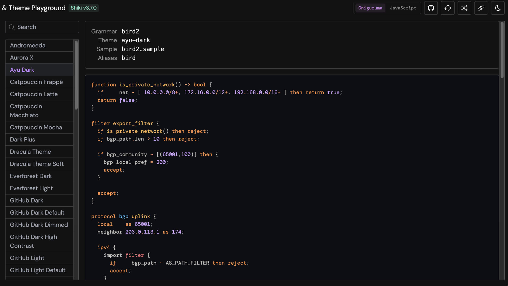
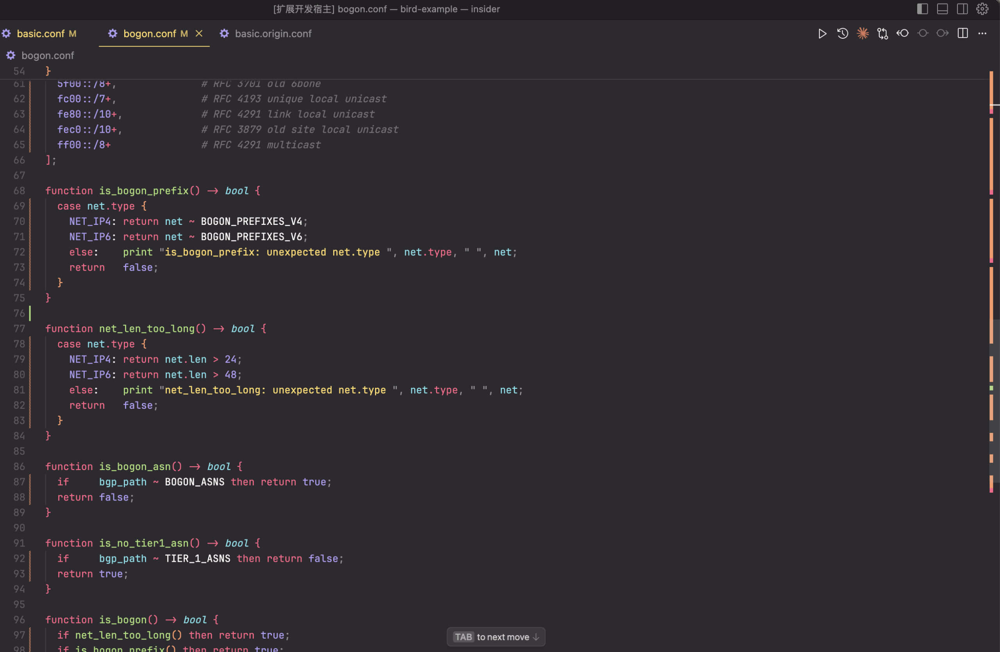
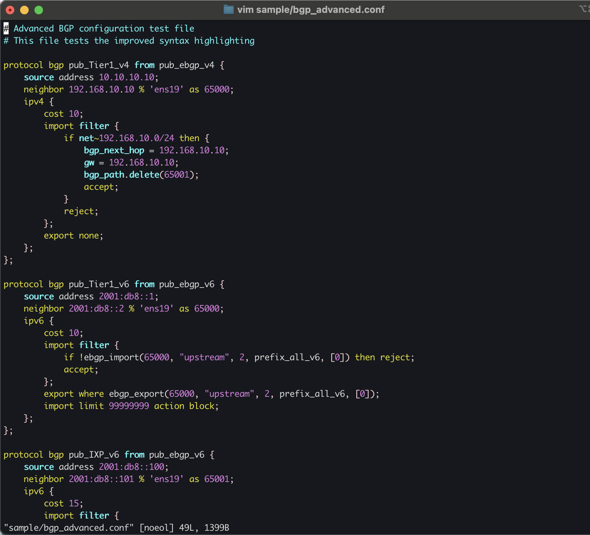
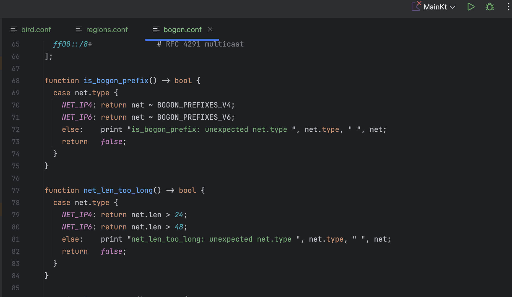

# BIRD2 Configuration Language

English | [简体中文](README.zh-CN.md)

 

## Table of Contents

- [Table of Contents](#table-of-contents)
- [Introduction](#introduction)
- [Why This Project](#why-this-project)
- [Try It Live](#try-it-live)
- [Editors \& IDE Support](#editors-ide-support)
  - [VSCode](#vscode)
  - [Vim](#vim)
  - [Jetbrains (TextMate Bundles)](#jetbrains-textmate-bundles)
- [Project Status](#project-status)
- [Community Adoption Evidence](#community-adoption-evidence)
  - [GitHub Usage Statistics](#github-usage-statistics)
  - [Production Deployment at Internet Scale](#production-deployment-at-internet-scale)
- [Contributors](#contributors)
- [License](#license)

## Introduction

> **BIRD** (BIRD Internet Routing Daemon)  
> Open-source routing daemon for managing routing tables on network infrastructure.

This repository hosts syntax files (`tmLanguage`) for BIRD2, designed to enhance developer productivity through syntax highlighting in configuration files.

Unlike the straightforward paradigms of INI or Nginx configurations, BIRD employs a distinctly intricate configuration model with unique implementation challenges.

## Why This Project

Despite its role in core internet infrastructure, BIRD2 still lacks native syntax highlighting and formatting support in mainstream editors like `VSCode` and `Shiki`.

Network engineers and developers have long relied on workarounds, such as using Nginx or INI syntax modes.

However, these do not accurately represent the complex grammar of BIRD2.

To address this issue, the **BIRD Chinese Community** has officially open-sourced a TextMate-based syntax grammar for BIRD2. Our goal is to improve developer experience and foster broader ecosystem support.

## Try It Live

- 🌐 **Playground** (via Shiki preview):
  [https://deploy-preview-149--textmate-grammars-themes.netlify.app/?theme=ayu-dark\&grammar=bird2](https://deploy-preview-149--textmate-grammars-themes.netlify.app/?theme=ayu-dark&grammar=bird2)

## Editors & IDE Support

### VSCode

 

- Install the VSCode extension from [Open VSX Registry](https://open-vsx.org/extension/BIRDCC/vscode-bird2-conf) / [VSCode Marketplace](https://marketplace.visualstudio.com/items?itemName=BIRDCC.vscode-bird2-conf).
- Open any BIRD2 configuration file and enjoy syntax highlighting.

### Vim

> [!NOTE]
> We recommend using VSCode for the best experience.
>
> Note: We are still in the testing phase for our support for Vim syntax highlighting.

1. Clone this repository: `git clone https://github.com/bird-chinese-community/bird-tm-language-grammar.git`.
2. Quick install: `bash scripts/install.sh` (installs Vim and Neovim)
   - Only Neovim: `bash scripts/install.sh --neovim`
   - Only Vim: `bash scripts/install.sh --vim`
   Or manual copy:
   - Vim: `cp grammars/bird2.syntax.vim ~/.vim/syntax/bird2.vim && cp -r misc/vim/ftdetect ~/.vim/`
   - Neovim: `cp grammars/bird2.syntax.vim ~/.config/nvim/syntax/bird2.vim && cp -r misc/nvim/plugin ~/.config/nvim/`
3. Open `sample/basic.conf` and verify highlighting. Optional: use `:verbose set ft?` to confirm `filetype=bird2`.

### Jetbrains (TextMate Bundles)

> [!NOTE]
> We recommend VSCode for the best experience, but JetBrains with TextMate Bundles works well for syntax highlighting.

1. Prepare the language pack
   a) Open https://open-vsx.org/extension/BIRDCC/vscode-bird2-conf ▸ Resources (lower right) ▸ Download the latest `.vsix` package;
   b) Unzip the `.vsix` file using any archiver;
   c) In the unzipped folder, locate the directory containing `package.json`, keep this path for the next step;
2. Open IntelliJ IDEA: Settings/Preferences ▸ Editor ▸ TextMate Bundles;
3. Click ➕ (Add) and select the directory from step 1(c);
4. Scroll the language list, confirm that `bird2` appears and check the box;
5. Follow prompts to restart the IDE.

## Project Status

- Pull requests have been submitted to upstream projects:

  - [ ] [GitHub Linguist #7513](https://github.com/github/linguist/pull/7513)
  - [ ] [Shiki #149](https://github.com/shikijs/textmate-grammars-themes/pull/149)

- 🚧 A VSCode plugin with full syntax highlighting and formatting support is actively under development.
  - 👉 [Join the closed beta on Telegram](https://t.me/bird_cnn/23) (Chinese only)

## Community Adoption Evidence

### GitHub Usage Statistics

- **27k+** BIRD2 configuration snippets found in public repositories ([View search results][public-code-search-results-list])
- **883+** active repositories using BIRD configurations ([View search results][public-repo-search-results-list])

### Production Deployment at Internet Scale

BIRD2 powers critical internet infrastructure for major operators:

- **AMS-IX** (World's largest IXP)  
  Handles **>870 ASNs** with 20k+ IPv4/5k+ IPv6 prefixes at **14Tb/s+** traffic  
  [Route-Server Platform](https://www.ams-ix.net/ams/documentation/ams-ix-route-servers)

- **LINX** (London Internet Exchange)  
  Migrated 1,000+ peer sessions to BIRD 2.13 across 7 global sites (2024)  
  [Technology Update](https://www.linx.net/wp-content/uploads/2024/05/Day-1-P4-LINX_Technology-Presentation_v3.0.pdf)

- **Cloudflare Anycast Edge**  
  Deployed on every server in 280+ PoPs for sub-second failover routing  
  [Architecture Deep Dive](https://blog.cloudflare.com/cloudflares-architecture-eliminating-single-p/)

## Contributors

The [BIRD Chinese Community](https://github.com/bird-chinese-community) extends gratitude to these contributors:

- [Alice39s](https://github.com/Alice39s)
- [pppwaw](https://github.com/pppwaw)

## License

- Syntax files are distributed under **[Mozilla Public License 2.0](LICENSE.syntax)**
- Sample configuration files (`/sample/*`) are distributed under **[MIT License](LICENSE.sample)**

[public-code-search-results-list]: https://github.com/search?q=%22protocol+bgp%22+OR+%22neighbor%22+OR+%22local+as%22+path%3A*.conf+NOT+is%3Afork&type=code&ref=advsearch
[public-repo-search-results-list]: https://github.com/search?q=bird+config&type=repositories&ref=advsearch
