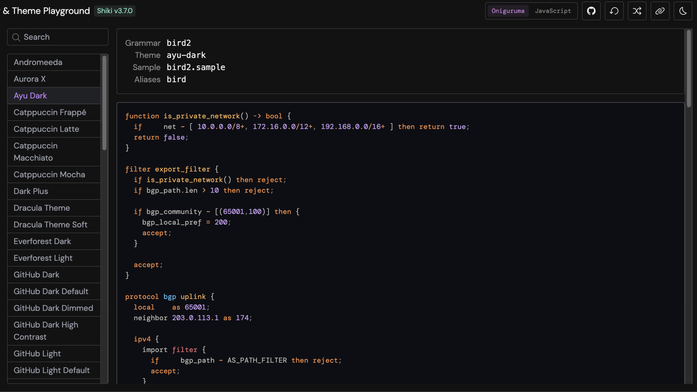
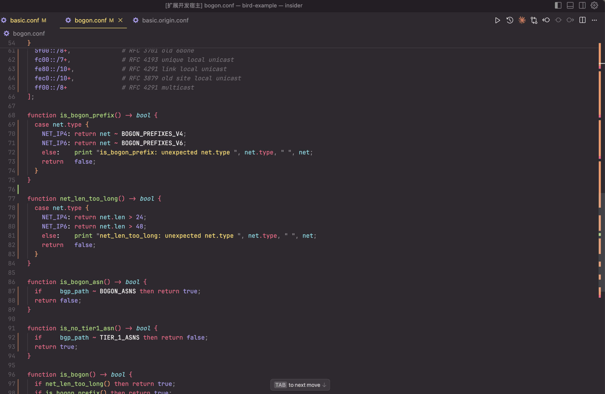
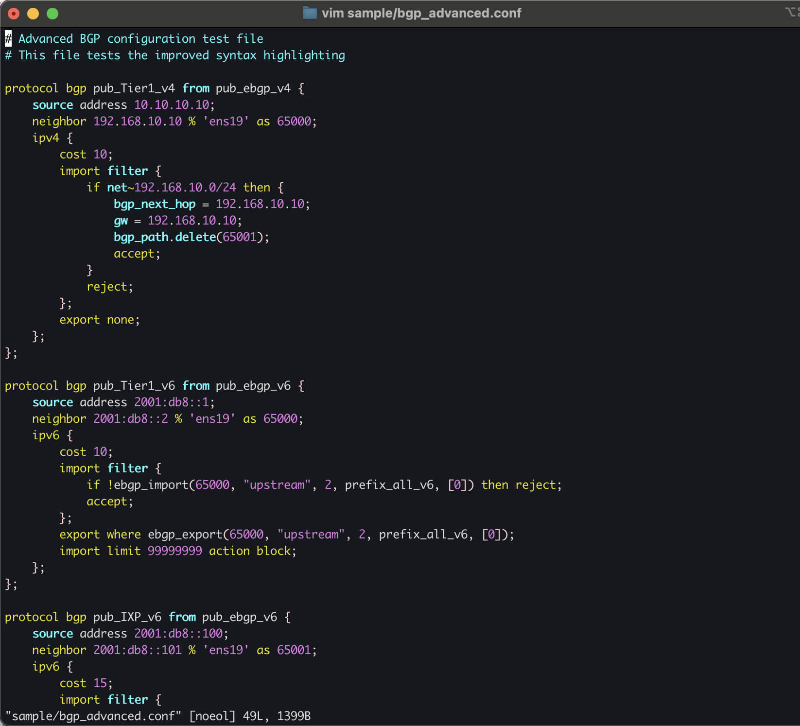
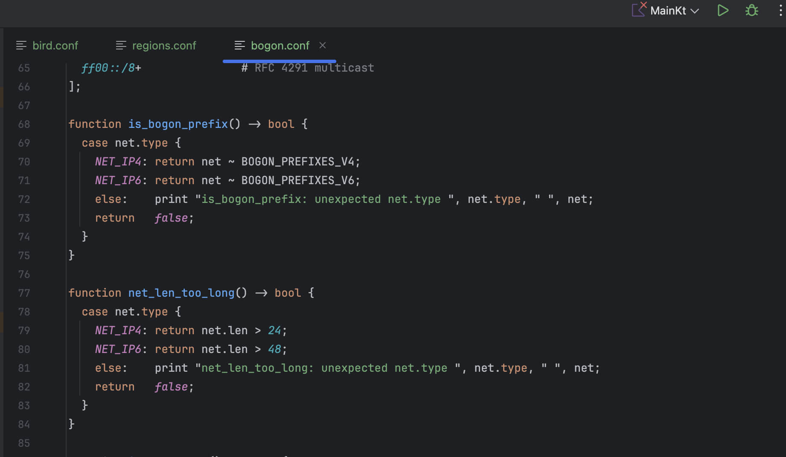

## BIRD2 Configuration Language

<div align="center">



简体中文 | [English](README.md)

[](https://github.com/bird-chinese-community/bird-tm-language-grammar/releases?q=tm-v) [](https://github.com/bird-chinese-community/bird-tm-language-grammar/releases?q=Vim%20Syntax)

</div>

### 目录

- [BIRD2 Configuration Language](#bird2-configuration-language)
  - [目录](#目录)
  - [项目背景](#项目背景)
  - [项目意义](#项目意义)
  - [在线体验](#在线体验)
  - [编辑器与 IDE 支持](#编辑器与-ide-支持)
    - [VSCode](#vscode)
    - [Vim 导入](#vim-导入)
    - [JetBrains（TextMate Bundles）](#jetbrains-textmate-bundles)
  - [开发工作流](#开发工作流)
  - [进展公示](#进展公示)
  - [贡献者致谢](#贡献者致谢)
  - [许可协议](#许可协议)

### 项目背景

> **BIRD**（BIRD Internet Routing Daemon）  
> 一个开源的路由守护进程，用于管理网络基础设施中的路由表。

本仓库提供 BIRD2 语法高亮文件（`tmLanguage`），可增强配置文件编写体验。

相较于 INI 或 Nginx 等简单且直观的配置范式，BIRD 采用特别且复杂的配置模型，甚至不能称其为简单的 “配置文件”，而更像是一种 “配置语言”。

### 项目意义

作为当今互联网核心基础设施的关键组成部分，BIRD2 至今仍缺乏主流编辑器（如`VSCode`/`Shiki`）的原生语法高亮与格式化支持。

截至目前, BIRD 网络工程师与开发者们长期依赖着 “变通方案”（如借用 Nginx 语法高亮/直接不使用高亮），但这些方案远远无法满足「准确且清晰地呈现 BIRD2 复杂的语法结构」的需求。

为此，**BIRD 中文社区** 正式开源了基于 TextMate 的 BIRD2 语法规范，致力于提升开发体验并推动生态建设。

### 在线体验

- 🌐 **Playground**（通过 Shiki 预览）：  
  [https://deploy-preview-149--textmate-grammars-themes.netlify.app/?theme=ayu-dark\&grammar=bird2](https://deploy-preview-149--textmate-grammars-themes.netlify.app/?theme=ayu-dark&grammar=bird2)

### 编辑器与 IDE 支持

#### VSCode



[](https://marketplace.visualstudio.com/items?itemName=BIRDCC.vscode-bird2-conf) [](https://open-vsx.org/extension/BIRDCC/vscode-bird2-conf)

- 安装 VSCode 扩展：[Open VSX Registry](https://open-vsx.org/extension/BIRDCC/vscode-bird2-conf) / [VSCode Marketplace](https://marketplace.visualstudio.com/items?itemName=BIRDCC.vscode-bird2-conf)。
- 打开任意 BIRD2 配置文件并享受语法高亮。

#### Vim / Neovim

<div align="center">



</div>

> [!NOTE]
> 我们推荐使用 VSCode 以获得最佳体验。
>
> Vim/Neovim 支持已迁移到独立仓库，获得更好的维护和功能更新。

**独立插件仓库：**

- **Vim**: [bird-chinese-community/bird2.vim](https://github.com/bird-chinese-community/bird2.vim)
- **Neovim**: [bird-chinese-community/bird2.nvim](https://github.com/bird-chinese-community/bird2.nvim)

**安装方式：**

Vim (使用 vim-plug):
```vim
Plug 'bird-chinese-community/bird2.vim'
```

Neovim (使用 lazy.nvim):
```lua
{
  "bird-chinese-community/bird2.nvim",
  ft = "bird2",
  config = function()
    require("bird2").setup()
  end
}
```

**向后兼容（本仓库仍可安装）：**

1. 克隆此仓库：`git clone https://github.com/bird-chinese-community/bird-tm-language-grammar.git`
2. 一键安装：`bash scripts/install.sh`（同时安装 Vim 和 Neovim）
   - 仅 Neovim：`bash scripts/install.sh --neovim`
   - 仅 Vim：`bash scripts/install.sh --vim`
3. 打开 `sample/basic.conf` 验证高亮；用 `:verbose set ft?` 查看是否为 `filetype=bird2`

#### JetBrains（TextMate Bundles）

<div align="center">



</div>

> [!NOTE]
> 我们推荐使用 VSCode 以获得最佳体验，此方案仅作为备选方案。

1. 准备语言包
   a) 打开 https://open-vsx.org/extension/BIRDCC/vscode-bird2-conf ▸ 右下角 Resources ▸ 下载最新 `.vsix` 安装包；
   b) 使用解压工具直接解压该 `.vsix` 文件；
   c) 在解压后的目录中，**找到包含 `package.json` 的目录**，并记录该路径；
2. 打开 IntelliJ IDEA：Settings/Preferences ▸ Editor ▸ TextMate Bundles；
3. 点击 ➕（Add）并选择刚才 `1(c)` 步的目录；
4. 在语言列表中找到 `bird2`，勾选启用；
5. 按提示重启 IDE 生效。

### 开发工作流

本仓库使用 **Prek** 作为 pre-commit 执行器。

1. 安装并启用 hooks：
   - `prek install --install-hooks --hook-type pre-commit --hook-type pre-push --hook-type commit-msg`
2. 在修改语法文件前后执行定向检查：
   - `prek run --files grammars/bird2.tmLanguage.json`
   - `prek run --files external/bird2.vim/syntax/bird2.vim external/bird2.nvim/syntax/bird2.vim`
3. 在提交或发起 PR 前执行：
   - `prek run --all-files`
4. 快速提升 tm 语法 + Vim/Neovim 语法快照的 patch 版本：
   - `node scripts/bump-version.js --dry-run`
   - `node scripts/bump-version.js`

### 进展公示

- 已向上游项目提交合并请求：

  - [ ] [GitHub Linguist #7513](https://github.com/github/linguist/pull/7513)
  - [ ] [Shiki #149](https://github.com/shikijs/textmate-grammars-themes/pull/149)

- 🚧 支持完整语法高亮与格式化的 VSCode 插件开发中
  - 👉 [加入 Telegram 封闭测试](https://t.me/bird_cnn/23)（中文社区专属）

### 贡献者致谢

向以下贡献者致敬：

- [Alice39s](https://github.com/Alice39s)
- [pppwaw](https://github.com/pppwaw)

### 许可协议

- 语法文件采用 **[Mozilla Public License 2.0](LICENSE.syntax)**
- 示例配置文件（`/sample/*`）采用 **[MIT License](LICENSE.sample)**

[public-code-search-results-list]: https://github.com/search?q=%22protocol+bgp%22+OR+%22neighbor%22+OR+%22local+as%22+path%3A*.conf+NOT+is%3Afork&type=code&ref=advsearch
[public-repo-search-results-list]: https://github.com/search?q=bird+config&type=repositories&ref=advsearch
